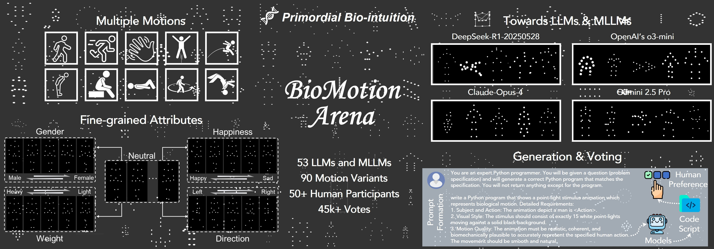
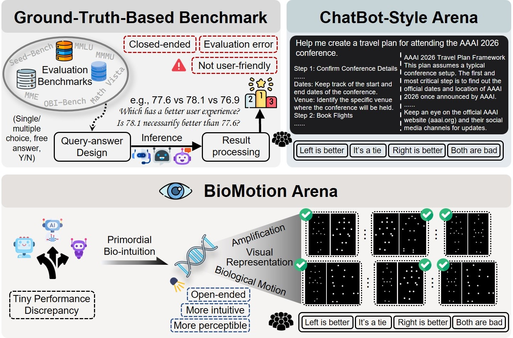
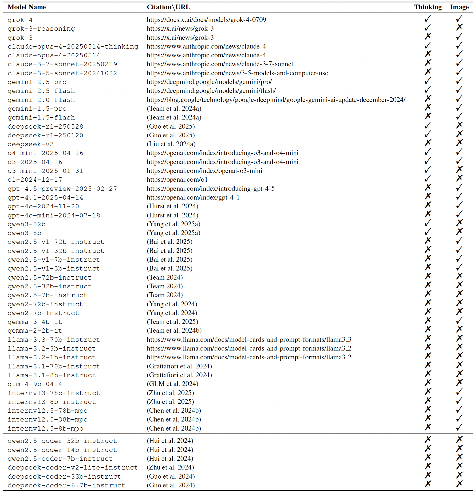
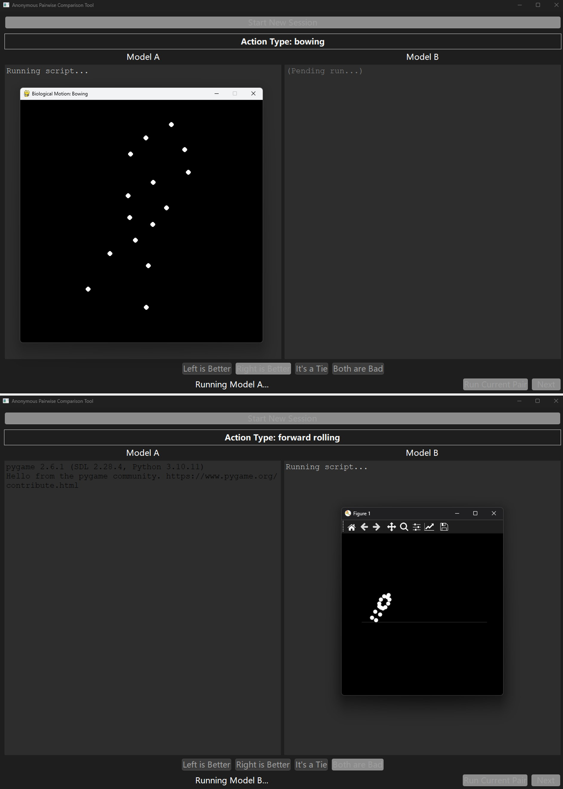
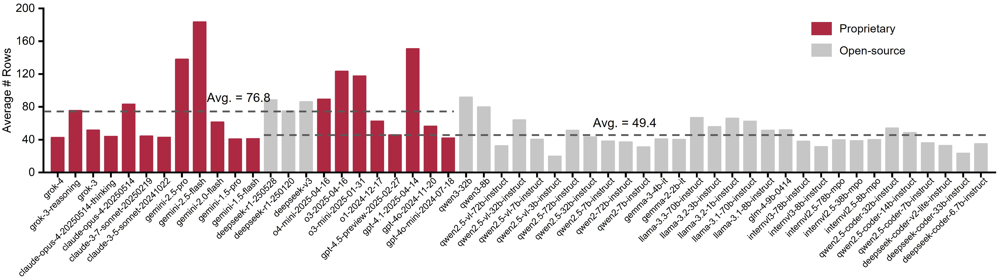
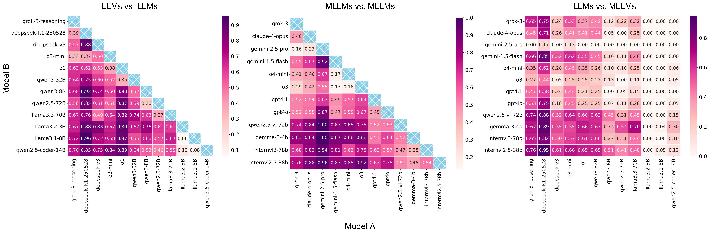
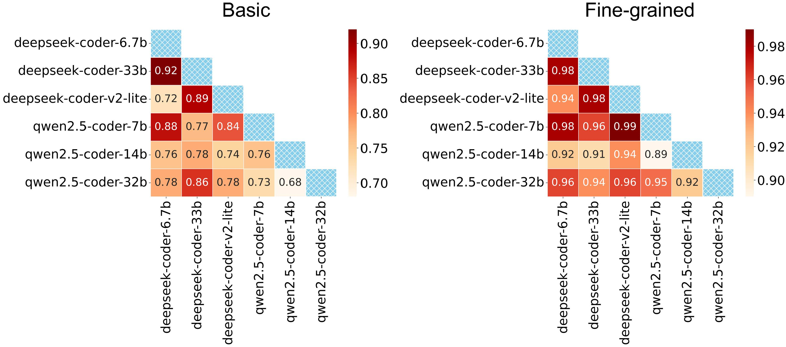
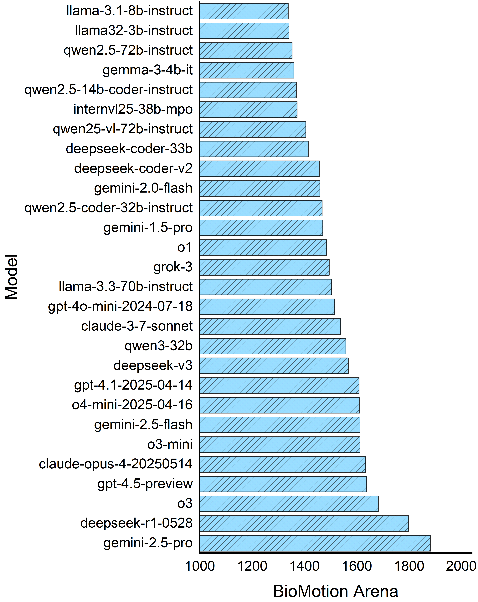
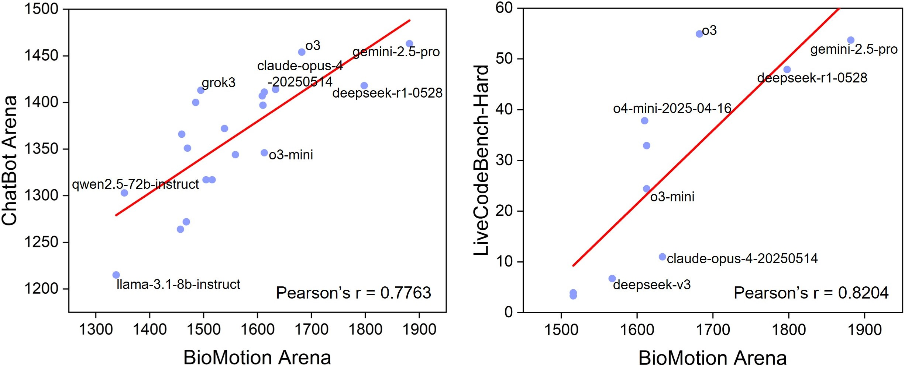

<div align="center">
<div>
<a href="https://zijianchen98.github.io/BioMotion-Arena/"></a>
    <a href="https://github.com/zijianchen98/BioMotion_Arena"></a>
    <a href="https://arxiv.org/abs/2508.06072"></a>
    <a href="https://zijianchen98.github.io/BioMotion-Arena/"></a>
</div>

<h1>Can Large Models Fool the Eye? A New Turing Test for Biological Animation 👀</h1>

_Even young infants can easily interpret the biological motions through pointlight display without any knowledge foundation_

<div>
    <a href="https://zijianchen98.github.io">Zijian Chen</a><sup>1,2</sup>,
   <a href="https://openreview.net/profile?id=~Lirong_Deng1">Lirong Deng</a><sup>3</sup>,
    <a href="https://openreview.net/profile?id=~Zhengyu_Chen13">Zhengyu Chen</a><sup>1</sup>,
     <a href="https://openreview.net/profile?id=~Kaiwei_Zhang2">Kaiwei Zhang</a><sup>2</sup>,
     <a href="https://scholar.google.com.hk/citations?hl=zh-CN&user=h-OG6DgAAAAJ">Qi Jia</a><sup>2</sup>,
     <a href="https://scholar.google.com.hk/citations?user=Kzd0qtsAAAAJ&hl=zh-CN">Yuan Tian</a><sup>2</sup>,
     <a href="https://scholar.google.com.hk/citations?user=lkEkF-kAAAAJ&hl=zh-CN">Yucheng Zhu</a><sup>1</sup>,
    <a href="https://scholar.google.com.hk/citations?hl=zh-CN&user=E6zbSYgAAAAJ" target="_blank">Guangtao Zhai</a><sup>1,2,*</sup>
</div>

<div>
  <sup>1</sup>Shanghai Jiao Tong University
  <br>
  <sup>2</sup>Shanghai AI Laboratory
  <br>
  <sup>3</sup>Macao Polytechnic University
  <br>
  <sup>*</sup>Corresponding author
  <br>
  <br>
</div>   


<div style="width: 100%; text-align: center; margin:auto;">
      
  </div>
</div>
<br>

> We propose **BioMotion Arena**, the first biological motion-based visual preference evaluation framework for large models. We focus on ten typical human motions and introduce fine-grained control over gender, weight, mood, and direction. More than **45k** votes for **53** mainstream LLMs and MLLMs on 90 biological motion variants are collected.

## Release 🚀
- [2025/08/11] 🔥 BioMotion Arena was highlighted in [Medium](https://medium.com/system-weakness/new-types-of-turing-tests-beyond-text-e739bcfd1a77) authored by [Berend Watchus](https://medium.com/@BerendWatchusIndependent)!
- [2025/08/08] ⚡️ [Project Website](https://zijianchen98.github.io/BioMotion-Arena/) for **BioMotion Arena** is online !

## Motivations 💡

Evaluating the abilities of large models and manifesting their gaps are challenging. Current benchmarks adopt either **ground-truth-based score-form** evaluation on static datasets or indistinct **textual chatbot-style** human preferences collection, which may not provide users with immediate, intuitive, and perceptible feedback on performance differences. In this paper, we introduce **BioMotion Arena**, a novel framework for evaluating large language models (LLMs) and multimodal large language models (MLLMs) via visual animation.

<div style="width: 50%; text-align: center; margin:auto;">
      
  </div>

## Motion Space 🧩

We include 10 typical human actions as well as four fine-grained attributes:

- Action: Walking, running, waving a hand, jumping up, jumping forward, bowing, lying down, sitting down, turning around, and forward rolling
- Gender: Man, woman
- Happiness: Happy, sad
- Weight: Heavy, light 
- Direction: Left, right, facing forward

## Participating LLMs and MLLMs 🤖

Our **BioMotion Arena** currently includes 53 large models (both LLMs and MLLMs) in total, with a mix of cutting-edge proprietary models, open-source models, and code-specific models.

<div style="width: 100%; text-align: center; margin:auto;">
      
  </div>

## Code 💻

We recommend directly installing the environment for the model to be evaluated.

1. Such as [Qwen2.5-VL](https://huggingface.co/Qwen/Qwen2.5-VL-7B-Instruct), [Qwen2.5](https://huggingface.co/Qwen/Qwen2.5-72B-Instruct), [llama3.3-70B](https://huggingface.co/meta-llama/Llama-3.3-70B-Instruct), [InternVL2.5](https://huggingface.co/OpenGVLab/InternVL2_5-78B), and [OpenAI](https://platform.openai.com/docs/overview).

2. Two code examples for both proprietary ([OpenAI's](./openai.py)) and open-source ([Qwen](./qwen.py)) LLMs are given. [openai-MLLM.py](./openai-MLLM.py) provides a code demo for MLLMs with reference image input.
```
python openai.py
python qwen.py
python openai-MLLM.py
```

## Human Preference Collection
Configure the evaluation pool and output path in [anmoy-subjective-exp.py](./subjective-exp-tool/anmoy-subjective-exp.py), then launch the UI code for anonymous subjective experiments.
```
cd subjective-exp-tool
python anmoy-subjective-exp.py
```

<div style="width: 80%; text-align: center; margin:auto;">
      
  </div>

Calculate the Elo score from the collected human preference:
```
python elo_score.py
```

## Main Results 📌

<details close>
<summary>The average lines of code for biological motion representation (click to expand)</summary>

<div style="width: 100%; text-align: center; margin:auto;">
      
  </div>
</details>

<details close>
<summary>Win-rate and the rate of ‘Both-are-bad’ (click to expand)</summary>

<div style="width: 100%; text-align: center; margin:auto;">
      
  </div>

  <div style="width: 100%; text-align: center; margin:auto;">
      
  </div>

</details>

<details close>
<summary>Elo scores of a subset of model (click to expand)</summary>

<div style="width: 100%; text-align: center; margin:auto;">
      
  </div>
</details>

<details close>
<summary>Comparison with Other Benchmarks (click to expand)</summary>

<div style="width: 100%; text-align: center; margin:auto;">
      
  </div>
</details>


## Contact ✉️

Please contact the first author of this paper for queries.

- Zijian Chen, `zijian.chen@sjtu.edu.cn`

## Citation 📎

If you find our work interesting, please feel free to cite our paper:
```
@misc{chen2025largemodelsfooleye,
      title={Can Large Models Fool the Eye? A New Turing Test for Biological Animation}, 
      author={Zijian Chen and Lirong Deng and Zhengyu Chen and Kaiwei Zhang and Qi Jia and Yuan Tian and Yucheng Zhu and Guangtao Zhai},
      year={2025},
      eprint={2508.06072},
      archivePrefix={arXiv},
      primaryClass={cs.CV},
      url={https://arxiv.org/abs/2508.06072}, 
}
```